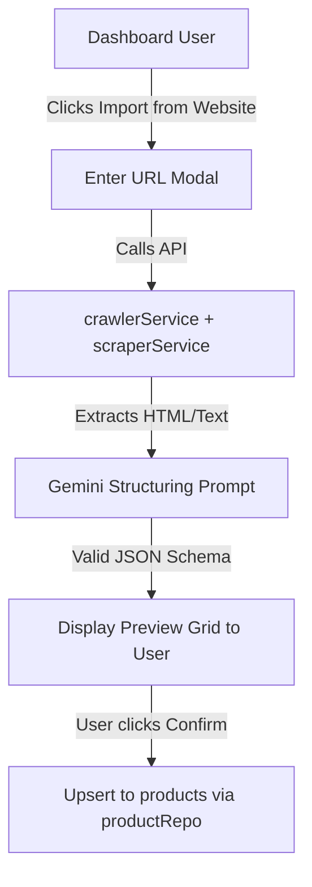

# PLAN: Affiliate Marketing, Web Crawling & Ingestion Sprint

## Objective
Implement the new Affiliate Marketing Module for Seliabot (B2B2C), introducing automated deep scraping from supplier websites (like `ybera.pa` or `iberaclub.pa`), dynamic affiliate link generation, and time-bound promotional scheduling.

---

## Technical Execution Roadmap

### 1. Database & Schema Migrations
* Create `database/migrations/migration_affiliate_marketing.sql` to:
  * Alter table `agent_configs` to add `affiliate_id` and `affiliate_slug`.
  * Alter table `products` to add `promo_start_date` and `promo_end_date`.
* Update types in [platform-api/src/types/index.ts](platform-api/src/types/index.ts).

### 2. Backend API Endpoint (scrape-import)
* Implement `POST /api/products/scrape-import` inside [platform-api/src/api/routes/products.ts](platform-api/src/api/routes/products.ts).
* Read parameters: `seedUrl`, `maxPages`, `maxDepth`.
* Instantiate the crawler from [platform-api/src/services/crawlerService.ts](platform-api/src/services/crawlerService.ts) and loop over crawled pages.
* Call Gemini (Pro or Flash) with the combined scraped text to extract structured products matching our `CreateProductInput` schema.
* Perform bulk insertion or upsert into `products` table using transaction safety.

### 3. Dynamic Link Rewriter Integration
* Update [platform-api/src/agent/agentController.ts](platform-api/src/agent/agentController.ts) inside the tool-execution / chat response loops.
* Intercept raw website URLs that match the target domain and replace/append the referral params using the active `agent_configs` tracking metrics.

### 4. Admin Dashboard UI
* In [platform-dashboard/src/pages/Products.tsx](platform-dashboard/src/pages/Products.tsx), add a high-visibility button "Importar de Sitio Web".
* Implement the multi-step modal:
  * **Step 1:** Enter landing page URL & options.
  * **Step 2:** Display loading state with real-time scraping logs.
  * **Step 3:** Preview table showing products, prices, images, and categories parsed by Gemini.
  * **Step 4:** Select products to import and click "Aprobar y Registrar".

---

## Architectural Flow

---

## Acceptance Criteria (Definition of Done)
- [ ] Database migration successfully registers fields.
- [ ] Deep scraping extracts correct product arrays via Gemini.
- [ ] In-bot chats correctly append affiliate tags on product links.
- [ ] Products page modal renders nicely on desktop & mobile with real-time import reviews.
- [ ] Platform compiles with zero TypeScript and linting errors.

