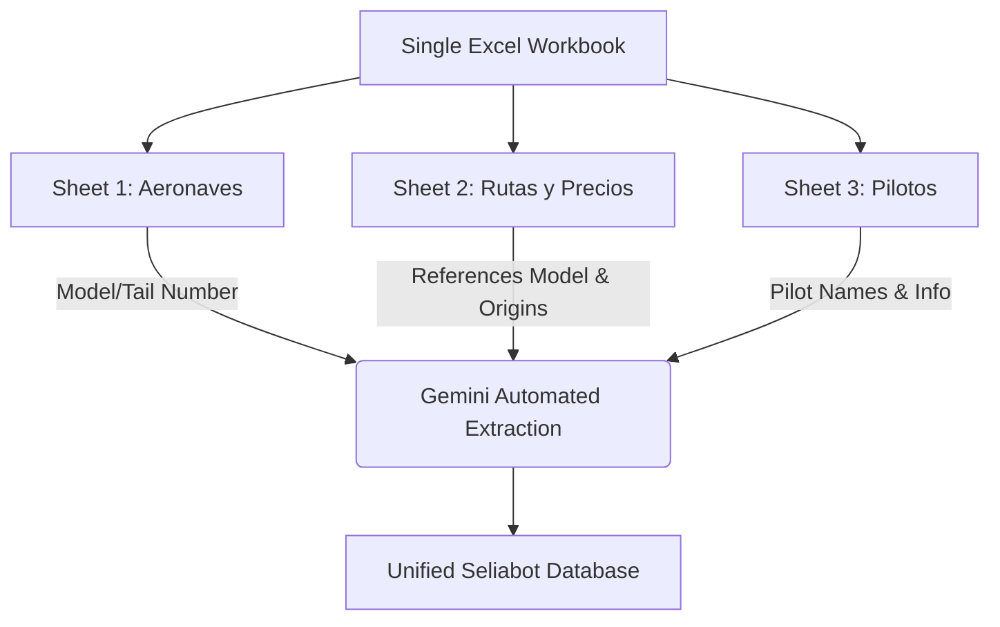

# AERORENTAL LIVE SIMULATION EVALUATION & IMPROVEMENTS REPORT

Date: 2026-06-08
Author: Chief Architect & CTO
Subject: Live testing of Aerorental simulation data (Prices, Aircraft, and Pilots tables)

---

## 1. EXECUTIVE SUMMARY

Seliabot platform is fully equipped to handle specialized aviation vertical operations. Our backend includes a highly automated, AI-driven bulk import service that can parse unstructured or semi-structured data from Excel, CSV, or PDF, preview the data via Gemini extraction, and confirm insertions into our specialized database schema.

This report evaluates how well Seliabot can automatically digest and map the pricing, aircraft, and pilots tables of a charter flight company similar to Aerorental, details the guidance we should provide to the client, and outlines strategic improvements we need to make to our own codebase.

---

## 2. PLATFORM AUTOMATIC MATCHING ASSESSMENT

Seliabot supports the exact concepts Aerorental requires. Through the specialized aviation vertical schemas defined in [database/migrations/migration_aviation.sql](database/migrations/migration_aviation.sql), our database represents aircraft, airport locations, routes, pricing, and pilot assignments natively:

1. **Aeronaves (Aircraft)**:
   - Table: `aviation_aircraft`
   - Fields: `model` (required), `manufacturer`, `tail_number` (registration e.g., HP-1234), `year`, `seat_capacity` (required, default 1), `max_load_lbs`, `hex_color`, `photo_urls`, `notes`.
   - Compatibility: **100%**. Seliabot represents aircraft as unique entities that link to calendar resources, maintaining seat capacity and max payload.

2. **Destinos y Rutas (Destinations & Prices)**:
   - Tables: `aviation_destinations` and `aviation_routes`.
   - Fields (Destinations): `name` (required), `iata_code` (e.g., PAC), `icao_code` (e.g., MPTO), `city`, `country`, `timezone` (defaults to 'America/Panama').
   - Fields (Routes): `aircraft_id`, `origin_id`, `destination_id`, `base_price`, `currency` (default USD), `duration_min`, `notes`.
   - Compatibility: **100%**. Price sheets map directly to routes which are junctions of `aircraft` × `origin` × `destination`.

3. **Pilotos (Operators/Crew)**:
   - Table: `aviation_operators`
   - Fields: `name` (required), `license_number` (license e.g., commercial pilot license mark), `phone` (phone number), `email`, `is_active`.
   - Compatibility: **100%**. Seliabot supports pilot master records and links them directly to dispatched orders via the `orders.aviation_operator_id` column.

4. **Automated AI Bulk Import Pipeline**:
   - Location: [platform-api/src/api/routes/aviation.ts](platform-api/src/api/routes/aviation.ts#L799)
   - Functionality: The `POST /api/aviation/import/preview` endpoint reads a file (Excel, CSV, or PDF), extracts the raw text contents, and feeds them into Gemini (Vertex AI / Google AI) using an explicit JSON schema to identify aircraft, destinations, routes, and pilots from arbitrary row-column structures.
   - The user then calls `POST /api/aviation/import/confirm` to write these records safely to the database, automatically cross-referencing and checking for duplicates.

---

## 3. CLIENT GUIDANCE FOR SIMULATION SUCCESS

To ensure that the Aerorental simulation data matches perfectly and imports without any warnings or skips, we should guide the client to format their sheets according to the following conventions:

### 3.1. Unified File Upload (The Single Workbook Rule)
- **Constraint**: Seliabot's import endpoint parses a single uploaded file.
- **Guidance**: Combine the Pricing, Aircraft, and Pilots tables into a **single Excel workbook (.xlsx)** with separate sheets (e.g., sheet 1: "Aeronaves", sheet 2: "Precios y Rutas", sheet 3: "Pilotos"). Seliabot reads all sheets of a workbook in parallel and Gemini stitches the cross-references together.

### 3.2. Reference Alignment
- **Constraint**: To link a pricing row (route) to a specific aircraft and destination, Seliabot resolves string references.
- **Guidance**:
  - The "Aeronave" reference in the prices table must exactly match the "Modelo" or "Matrícula" (tail number) of an aircraft in the aircraft table (e.g., if the plane is "Kodiak 100", the route row should say "Kodiak 100", not "Kodiak").
  - The origins and destinations in the prices table must be specific. Include 3-letter IATA codes or exact location names (e.g., "MPMG" or "Albrook" vs. "Panamá" if there are multiple strips).

### 3.3. Technical Formatting
- **Guidance**:
  - **No merged cells**: Keep table layouts flat and continuous. Avoid merged header cells.
  - **Phone formats**: Write pilot and crew phone numbers in international E.164 format (e.g., "+50768308000") so they integrate natively with WhatsApp notification modules.
  - **Seat capacity**: Ensure the seat capacity is explicitly defined for each aircraft (as a number) so that Seliabot's travel reasoning loop can prevent overbooking.

---

## 4. SELIABOT PLATFORM IMPROVEMENTS

During our evaluation of [platform-api/src/api/routes/aviation.ts](platform-api/src/api/routes/aviation.ts), we identified several key improvements we should implement on Seliabot to make the platform onboarding process even more seamless:

### 4.1. Automatic Product Catalog Generation on Confirmation
- **Issue**: Currently, `POST /api/aviation/import/confirm` inserts the rows into `aviation_aircraft`, `aviation_destinations`, `aviation_routes`, and `aviation_operators`. However, it does not automatically generate the booking products in the `products` catalog. The tenant has to manually trigger the `POST /api/aviation/routes/:id/generate-product` endpoint for every single imported route.
- **Improvement**: Modify the confirmation endpoint in [platform-api/src/api/routes/aviation.ts](platform-api/src/api/routes/aviation.ts#L1070) to automatically loop through and trigger product generation for all newly created routes. This will populate their catalog instantly upon import confirmation!

### 4.2. Pilot-Aircraft Preferential Mapping
- **Issue**: We have a master table for pilots (`aviation_operators`) and a master table for planes (`aviation_aircraft`). However, we have no table representing which pilots are certified to fly or are preferred for which aircraft. Seliabot's dispatch system assigns pilots to orders manually at dispatch time.
- **Improvement**: Introduce an association/junction table (e.g., `aviation_operator_aircraft`) or a nullable foreign key `preferred_aircraft_id` on the `aviation_operators` table. This allows the AI agent or dispatch system to suggest pilots automatically based on the aircraft booked.

### 4.3. Multi-file Upload Interface
- **Issue**: The dashboard UI must instruct the user to merge files into a single workbook because the backend uses a single-file multer middleware (`fleetImport.single('file')`).
- **Improvement**: Support multiple concurrent files (`fleetImport.array('files', 3)`) on the import endpoint, parsing and joining text content from multiple files before passing it to Gemini, giving the client total freedom of how they upload their tables.

### 4.4. Full Dashboard UI Integration
- **Issue**: The backend endpoints for bulk fleet import are fully featured, but the React frontend in `platform-dashboard` requires polished UI pages for bulk importing (with Excel templates, raw text logs, and custom mappings).
- **Improvement**: Create a designated "Bulk Import" tab in the Fleet management view to expose this Gemini-driven pipeline directly to tenants.
