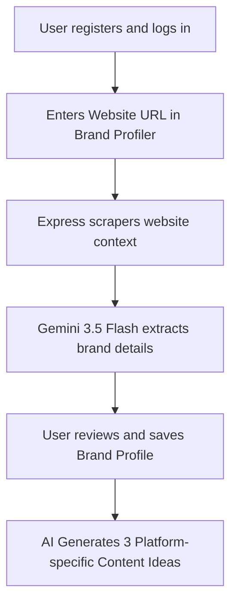
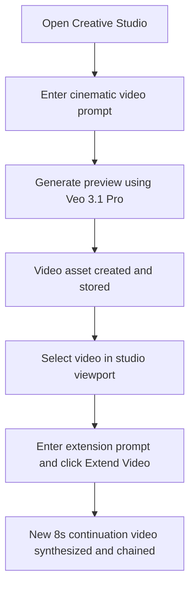

# PRODUCT REQUIREMENT DOCUMENT (PRD)

**Project Name**: Social.Flow (socialobot)  
**Document Version**: 2.1.0  
**Author**: Senior Product Manager (Experienced Product Manager)  
**Status**: APPROVED & IMPLEMENTED  
**Date**: June 12, 2026  

---

## 1. Executive Summary

Social.Flow is an enterprise-grade, AI-driven social media management and visual content generation platform. The system bridges the gap between marketing strategy and creative execution by using state-of-the-art Google GenAI models. 

Unlike traditional scheduling tools that act as simple database queues (e.g., Buffer, Hootsuite), Social.Flow operates as a **full-lifecycle, autonomous content partner**. It ingests raw brand profiles (from website scraping), ideates viral content, generates high-fidelity visual and video assets (via Google Imagen 3 and Veo 3.1), analyzes them for viral potential, executes real-world multi-platform publishing (Instagram), conducts automated A/B test experiments, and hosts an interactive AI social strategist chat to orchestrate the entire workflow.

---

## 2. Problem Statement & Target Audience

### 2.1 The Problem
- **High Friction in Creative Generation**: Social media managers and business owners spend hours writing captions and designing graphics, or pay high fees for agency-driven visual generation.
- **Disconnected Workflows**: Strategy (ideation), asset design (Canva/Midjourney), scheduling (Buffer), and publishing are separate, disjointed steps.
- **Lack of Strategic Optimization**: Small-to-medium businesses (SMBs) post without understanding optimal timing, viral hooks, or platform algorithms.
- **Data-Dry Scheduling**: Traditional tools do not allow real-time automated A/B strategy experiments or comprehensive caption/image auditing before publishing.

### 2.2 Target Personas
1.  **Lucas (The Agency Operator)**: Manages 10+ brand handles. Needs high-velocity ideation, rapid asset synthesis, and multi-tenant isolation.
2.  **Sofia (The D2C E-commerce Founder)**: Lacks a marketing department. Needs a tool that acts as her Chief Marketing Officer (CMO), turning her website URL into a cohesive social calendar in minutes.
3.  **Carlos (The Content Creator)**: Focuses heavily on high-impact visual media (Reels/TikToks). Needs advanced video generation and narrative continuation tools to maintain cohesive storytelling.

---

## 3. Product Goals & Success Metrics

### 3.1 Product Goals
- **End-to-End Automation**: Reduce the time required to create, schedule, and publish a high-quality post from 45 minutes to under 2 minutes.
- **Visual Cohesion**: Standardize high-fidelity AI-generated imagery and cinematic video clips grounded in specific brand profiles.
- **Actionable Virality Analysis**: Grade captions and assets BEFORE publication, minimizing low-performing organic posts.
- **Secure Platform Connection**: Provide enterprise-grade encryption and secure OAuth flows for direct-publishing channels.

### 3.2 Key Performance Indicators (KPIs)
- **Time-to-Publish Reduction**: Target $\geq 90\%$ reduction in manual marketing tasks.
- **AI-Generation Success Rate**: Track $\ge 98\%$ successful Imagen/Veo asset synthesis.
- **Real Instagram Publishing Reliability**: Ensure 2-step media container publishing has a error rate of $\le 1.5\%$.
- **User Retention / Engagement**: Measured by usage frequency of the AI Strategist Agent and Content Arsenal.

---

## 4. Functional Requirements & Epics

### Epic 1: Brand Profiling & Persona Extraction
- **Requirement**: Users input their company name, website, and general inputs.
- **System Action**: 
  - Scrapes the website URL (extracting titles, headings, and body snippets).
  - Uses `gemini-3.5-flash` to analyze the scraped content.
  - Automatically synthesizes a structured **Brand Profile** including: Buyer Persona, Target Buyers, Brand Voice/Tone, Key Products, and Industry category.
- **Value**: Eradicates manual form-filling, providing instant strategic alignment.

### Epic 2: AI Idea Generation & Content Inspiration
- **Requirement**: Synthesize contextual post ideas based on the active Brand Profile and a target social platform.
- **System Action**:
  - Generates 3 cohesive **Content Ideas** detailing: Title, Hook, Body Description, recommended Platform, Visual Prompt, Audience Segment, Recommended Time, and Optimal Time Reasoning.
- **Value**: Prevents creative block, aligning scheduling times with algorithm trends.

### Epic 3: Multimodal Content Arsenal (Asset Library)
- **Requirement**: A centralized media repository where users upload images or videos.
- **System Action**:
  - Uploads raw assets to Firebase Storage and indexes metadata in Firestore.
  - Automatically triggers a multimodal analysis using `gemini-3.5-flash` to inspect the image/video.
  - Generates a **Spanish description** (for cataloging) and an **English visual prompt** (for Midjourney/Imagen/Veo image reproduction).
- **Value**: Catalogs assets with zero manual tagging, extracting style rules automatically.

### Epic 4: Creative Studio Sandbox (Generative AI)
- **Requirement**: A powerful creation suite for on-demand image and video synthesis.
- **System Action**:
  - **AI Image Generation**: Built-in integration with Google **Imagen 3** (supporting production stable `gemini-3.1-flash-image` and premium `gemini-3-pro-image`). Supports custom aspect ratios and direct sandbox injection.
  - **AI Video Generation**: Flagship **`veo-3.1-generate-preview`** integration. Generates high-fidelity cinematic preview clips.
  - **Video Extension & Continuation**: Supports progressive storytelling by enabling users to select a completed video, input a continuation prompt, and extend the video timeline (+7 seconds) while maintaining visual continuity.
  - **History Reloading**: Clicking any historical asset in the Showcase reloads the full state (prompts, aspect ratio, model) back into the active viewport, allowing seamless revisions.

### Epic 5: Smart Social Calendar & Scheduling
- **Requirement**: A centralized dashboard showing scheduled, draft, and published posts on a monthly/weekly grid.
- **System Action**:
  - Renders all social posts on a highly interactive Tailwind calendar.
  - Allows editing, deleting, or rescheduling posts.
  - Supports staging posts in various states: `Draft`, `Scheduled`, `Posting`, `Posted`, `Simulated`, or `Failed`.

### Epic 6: Social Platform Integration & Publishing
- **Requirement**: Real-world connection and publishing capabilities, prioritizing Instagram.
- **System Action**:
  - **OAuth Integration**: Secure Facebook/Instagram OAuth handshake, minting secure tenant-scoped cookies.
  - **2-Step Direct Publishing**: 
    1. Creates a media container on Instagram Graph API (processing images or videos as REELS).
    2. Polls container ingestion status (waiting for `status_code === "FINISHED"`).
    3. Triggers direct publishing container release, returning a real platform `externalPostId`.
  - **Simulated Channels**: Provides high-fidelity simulated publishing states for TikTok, Facebook, and LinkedIn. To maintain user transparency and prevent confusion, all UI panels rendering these non-Instagram channels must display a clear, stylized simulated indicator or badge.

### Epic 7: Virality Auditing & Copy Optimization
- **Requirement**: Prior to scheduling, users can audit their captions and image ideas.
- **System Action**:
  - Analyzes copy against 5 critical vectors: **Hook Strength, Trend Alignment, Shareability, Visual Impact, and Call to Action (CTA)**.
  - Returns numeric scores (0-100), an overall **Virality Score**, and detailed feedback.

### Epic 8: A/B Campaign Testing
- **Requirement**: Run split-tests comparing two communication strategies (e.g., educational vs direct-offer).
- **System Action**:
  - Groups two posts under an `ABCampaign`.
  - Strategy A and Strategy B post with distinct styles/copy.
  - Simulates or fetches campaign statistics (Impressions, Engagement Rates) and declares a statistical Winner.

### Epic 9: Agentic AI Strategist (Google ADK)
- **Requirement**: An interactive chatbot serving as an on-demand CMO.
- **System Action**:
  - Backed by Google Agent Development Kit (`@google/adk`) running `LlmAgent`.
  - Accessible via interactive sidebar chat.
  - **Integrated Tools**: 
    - `GoogleSearchTool` (for analyzing current trends).
    - `generate_content_ideas` (structural ideator).
    - `analyze_viral_score` (copy scoring).
    - `get_optimal_schedule` (calendar strategist).
    - `research_hashtags` (hashtag optimization).
    - `browse_content_arsenal` (visual library awareness).

### Epic 10: Experimental Playgrounds (El Rincón de Mamá / Space Remodeler)
- **Requirement**: A high-delight, elder-friendly household design sandbox.
- **System Action**:
  - **Visual Isolation**: Positioned under a separate, clearly defined "Experimental Playgrounds" sidebar section to maintain the B2B console's professional marketing focus.
  - **Coherent Labeling**: Named "Space Remodeler (Mamá's Corner)" to unify global English terminology with the senior-accessible Spanish residential styling presets and emotional loading states.
  - **Multimodal Synthesis**: Coordinated via `/api/remodel-space` using Gemini 3.5 Flash for room layout analysis and stable Imagen 3 for beautiful redesign outputs.

---

## 5. Non-Functional Requirements (NFRs)

### 5.1 Security & Data Isolation
- **Tenant Isolation**: Strictly enforce multi-tenant separation. No user should be able to view, edit, or delete another user's brand profile, scheduled posts, connections, or uploaded media assets.
- **Credential Storage**: Access tokens acquired via OAuth must never be stored in plain text. They must be encrypted at rest.
- **Static Analysis Compliance**: No secrets, private keys, or API tokens may be hardcoded. Use Environment Variables.

### 5.2 Performance & Scalability
- **Image Generation Time**: Imagen 3 renders should return within $\le 8$ seconds.
- **Video Generation Time**: Veo 3.1 preview renders should return within $\le 45$ seconds.
- **Page Load Speed**: Core dashboard widgets and calendar must load under $\le 1.2$ seconds for optimal UX.

### 5.3 Reliability & Graceful Fallbacks
- **Offline/Bypass Mode**: In the absence of server connections, GCP credentials, or Gemini API keys, the frontend must fall back to local high-fidelity simulators, allowing testing and demonstrations without crash states.
- **Rate Limiting**: Express middleware must throttle requests to block DDoS and abuse (limit of 120 API requests per minute per IP).

---

## 6. Primary User Journeys & Workflows

### Journey A: The Instant Brand Launch

### Journey B: Generating and Extending Video Content

---

## 7. Future Roadmap

- **Phase 1 (Done)**: Stable Google GenAI migration (`gemini-3.5-flash`), Imagen 3, Veo 3.1 Pro engine integrations, progressive video extension, and multimodal Content Arsenal.
- **Phase 2 (Upcoming)**: Support for real-world automated publishing to TikTok and LinkedIn (OAuth and publishing handlers).
- **Phase 3 (Long-term)**: Advanced computer vision auditing of uploaded graphics, comparing brand asset alignment against strict visual style guides.
