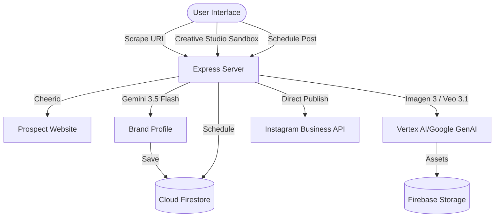

# Social.Flow (socialobot) — Platform Architecture

## 1. Repository Structure
```
socialobot/
├── README.md                  # Quickstart guide
├── package.json               # dependencies (React 19, Tailwind v4, @google/genai, @google/adk)
├── tsconfig.json              # TypeScript compilation rules
├── vite.config.ts             # Vite server and React building config
├── server.ts                  # Entry Express server containing routing and Vite middleware
│
├── server/                    # Node.js Express backend services
│   ├── admin.ts               # Firebase Admin SDK initialization
│   ├── auth.ts                # Session cookie verification & JWT handling
│   ├── store.ts               # Firestore collection wrapper queries
│   ├── scrape.ts              # Website crawler using cheerio
│   ├── validate.ts            # Zod validation schemas
│   ├── agents.ts              # LlmAgent run handlers (Google ADK)
│   ├── instagramPublisher.ts  # Multi-step direct release for Instagram Graph API
│   ├── storage.ts             # Firebase Storage upload handlers
│   └── utils/
│       └── mock.ts            # Mock statistics generators
│
├── src/                       # React 19 Frontend
│   ├── main.tsx               # App mounting point
│   ├── App.tsx                # Central workspace coordinator
│   ├── types.ts               # Core TypeScript definitions (BrandProfile, SocialPost, etc.)
│   ├── firebase.ts            # Frontend Firebase auth/storage init
│   ├── components/            # Reusable React UI blocks
│   │   ├── Sidebar.tsx        # Navigation sidebar with isolated labs
│   │   ├── CalendarView.tsx   # Social planning grid containing warning legends
│   │   └── ConnectedPlatforms.tsx # Integration cards showing warning badges
│   └── utils/
```

---

## 2. Platform Component Flow


---

## 3. Data Schema (Firestore Collections)

### 3.1 `brand_profiles`
*   `userId`: string (Primary Index)
*   `companyName`: string
*   `website`: string
*   `voice`: string
*   `buyerPersona`: string
*   `industry`: string
*   `keyProducts`: array of strings

### 3.2 `posts`
*   `id`: string
*   `userId`: string
*   `title`: string
*   `hook`: string
*   `body`: string
*   `platform`: string (`instagram`, `tiktok`, `facebook`, `linkedin`)
*   `imageUrl`: string
*   `videoUrl`: string
*   `status`: string (`draft`, `scheduled`, `posted`, `failed`, `simulated`)
*   `scheduledTime`: timestamp
*   `viralityScore`: number

---

## 4. API Endpoints Reference

### 4.1 Authentication & Profile
*   `POST /api/oauth/session` — Mints JWT secure session cookie.
*   `POST /api/brand-profile` — Scrapes site and generates brand voice.
*   `GET /api/brand-profile` — Retrieves saved tenant profile.
*   `POST /api/brand-profile/scan-handle` — Custom scraping profile.

### 4.2 Content Ideas & Calendar
*   `POST /api/ideas/generate` — Creates post ideas based on Brand Profile.
*   `GET /api/ideas` — Fetches ideas history.
*   `POST /api/posts` — Creates and schedules a post.
*   `GET /api/posts` — Lists scheduled posts.
*   `POST /api/posts/update` — Reschedules or modifies post text.

### 4.3 Generative AI Sandbox
*   `POST /api/posts/generate-ai-image` — Runs Imagen 3 image generation.
*   `POST /api/generate-veo` — Requests cinematic preview generation.
*   `POST /api/generate-veo/status` — Checks Veo task completion.
*   `POST /api/generate-veo/extend` — Appends timeline continuation clip.
*   `POST /api/remodel-space` — Space Remodeler Imagen 3 task.

### 4.4 Publishing & Campaigns
*   `POST /api/posts/publish` — Triggers direct publishing flow.
*   `POST /api/ab-campaigns` — Creates split-testing variants.
*   `GET /api/ab-campaigns` — Lists A/B test results.
*   `GET /api/platforms/instagram/recent-media` — Live Instagram feed query.
*   `GET /api/platforms/:platform/stats` — Metrics endpoint.

### 4.5 Agentic AI Strategist
*   `POST /api/agent/run` — Executes a chat turn on `@google/adk` LlmAgent.

---

## 5. Frontend UI Refactor (Phase 1 & 2)
The application has recently undergone a major refactor to eliminate the `App.tsx` monolith (which exceeded 3,500 lines).

### Key Architectural Shifts:
1. **Component Isolation:** 
   Features such as `AICopilotView`, `BrandProfileView`, `IdeasVaultView`, `PublisherView`, `CreativeStudioView`, and `ABTestsView` are now separated into individual components under `src/components/`.
2. **State Management (Context API):** 
   To avoid prop-drilling dozens of hooks down the component tree, `AppContext.tsx` acts as the global state provider, injecting `brandProfile`, `activeTab`, `posts`, and `creatorPlatform` directly into the leaf nodes.
3. **Best Practices for New Modules:**
   - **DO NOT** use inline UI blocks in `App.tsx`.
   - **DO NOT** use local `useState` in `App.tsx` for shared states.
   - Utilize `useApp()` to consume data.
